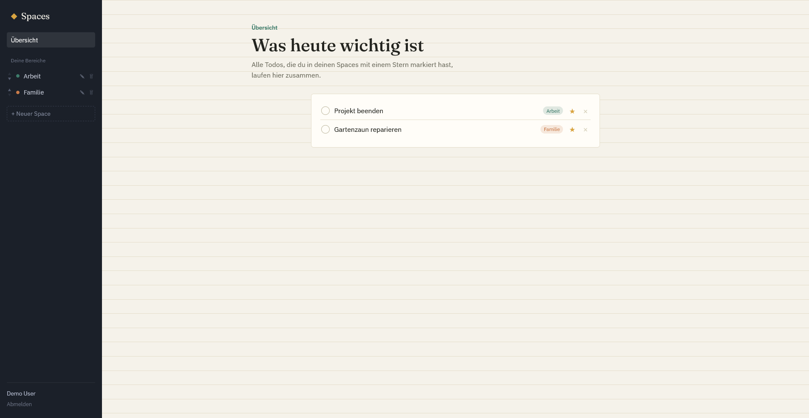
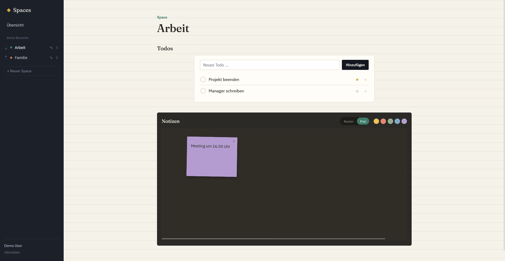

# SpaceTodo

**SpaceTodo** is a small, self-hosted Todo & Notes app for organizing different areas of your life.

Create separate **Spaces** for things like work, hobbies, projects, or personal tasks. Each Space contains a Todo list and a freely arrangeable corkboard for sticky notes.

The home page gives you an overview of all **important, open Todos** across your Spaces.

Authentication is handled exclusively through **OpenID Connect (OIDC)**. SpaceTodo does not have its own password system.

> 🚧 **Early-stage project:** SpaceTodo is currently under active development. APIs, database schemas, and configuration may change between releases.

## ✨ Features

* 🔐 OIDC authentication with Authorization Code + PKCE
* 🗂️ Multiple Spaces with individual colors
* ✅ Todo lists for each Space
* ⭐ Mark Todos as important
* 📌 Sticky-note corkboards
* 🎨 Different colors for sticky notes
* 🖱️ Drag & drop positioning of notes
* 🏠 Home page aggregating all important, open Todos
* 🐘 PostgreSQL for persistent data and sessions
* 🐳 Docker Compose setup for self-hosting
* 🔑 No local password database

## 📸 Screenshots

<!-- Add screenshots here -->



<!--
Example:


-->

## 🏗️ Architecture

SpaceTodo consists of three main components:

```text
                    ┌─────────────────┐
                    │     Browser     │
                    └────────┬────────┘
                             │
                             ▼
                    ┌─────────────────┐
                    │      Nginx      │
                    │  Static frontend│
                    │   /api → backend│
                    │  /auth → backend│
                    └───────┬─────────┘
                            │
                 ┌──────────┴──────────┐
                 ▼                     ▼
        ┌─────────────────┐   ┌─────────────────┐
        │ Node.js Backend │   │   PostgreSQL    │
        │Express/Sequelize│──▶│ Data + Sessions │
        │     OIDC        │   └─────────────────┘
        └────────┬────────┘
                 │
                 ▼
          ┌───────────────┐
          │  OIDC Provider│
          │ Keycloak etc. │
          └───────────────┘
```

### Technology Stack

* **Frontend:** React + Vite
* **Backend:** Node.js + TypeScript + Express
* **Database:** PostgreSQL
* **ORM:** Sequelize
* **Authentication:** OpenID Connect via `openid-client`
* **Reverse proxy / static files:** Nginx
* **Deployment:** Docker Compose

## 🚀 Quick Start

### Requirements

For the Docker-based setup you need:

* Docker
* Docker Compose

You also need an OIDC provider, for example:

* Keycloak
* Authentik
* Zitadel
* Google Workspace
* Microsoft Entra ID / Azure AD
* Authelia
* Pocket ID
* or another standards-compliant OIDC provider

### 1. Clone the repository

```bash
git clone https://github.com/Ludoo0/spaceTodo.git
cd spaceTodo
```

### 2. Create the environment file

```bash
cp .env.example .env
```

Edit `.env` and configure at least:

```env
POSTGRES_PASSWORD=change-me
SESSION_SECRET=change-me

OIDC_ISSUER_URL=https://your-oidc-provider.example.com
OIDC_CLIENT_ID=your-client-id
OIDC_CLIENT_SECRET=your-client-secret

FRONTEND_URL=http://localhost:8080
OIDC_REDIRECT_URI=http://localhost:8080/auth/callback
```

See [Configuration](#configuration) for all available settings.

### 3. Start SpaceTodo

```bash
docker compose up -d --build
```

The application should now be available at:

```text
http://localhost:8080
```

The port can be changed using `HTTP_PORT`.

<a id="configuration"></a>

## ⚙️ Configuration

SpaceTodo is configured through environment variables.

| Variable             | Required   | Description                                 |
| -------------------- | ---------- | ------------------------------------------- |
| `POSTGRES_PASSWORD`  | Yes        | Password for the PostgreSQL database        |
| `SESSION_SECRET`     | Yes        | Secret used to protect server-side sessions |
| `OIDC_ISSUER_URL`    | Yes        | Base URL of your OIDC provider              |
| `OIDC_CLIENT_ID`     | Yes        | OIDC client ID                              |
| `OIDC_CLIENT_SECRET` | Yes        | OIDC client secret                          |
| `OIDC_REDIRECT_URI`  | Yes        | OIDC callback URL                           |
| `FRONTEND_URL`       | Yes        | Public URL of the application               |
| `COOKIE_SECURE`      | Production | Set to `true` when using HTTPS              |
| `HTTP_PORT`          | No         | Port exposed by Docker, defaults to `8080`  |

Check `.env.example` for the complete and current list of supported variables.

## 🔐 OIDC Setup

SpaceTodo uses the **OpenID Connect Authorization Code Flow with PKCE**.

Create a confidential/web client in your OIDC provider.

### Client configuration

Use:

* **Grant type:** Authorization Code
* **PKCE:** enabled/supported
* **Scopes:** `openid profile email`
* **Redirect URI:**

```text
${FRONTEND_URL}/auth/callback
```

For a local installation:

```text
http://localhost:8080/auth/callback
```

The exact redirect URI must be registered with your OIDC provider.

### Keycloak example

For Keycloak:

1. Create a new client under **Clients → Create client**.
2. Choose **OpenID Connect**.
3. Enable client authentication.
4. Configure the redirect URI:

```text
http://localhost:8080/auth/callback
```

5. Copy the generated client secret.
6. Configure SpaceTodo:

```env
OIDC_ISSUER_URL=https://<your-keycloak>/realms/<your-realm>
OIDC_CLIENT_ID=spacetodo
OIDC_CLIENT_SECRET=<your-client-secret>
OIDC_REDIRECT_URI=http://localhost:8080/auth/callback
```

Other OIDC providers work on the same principle. The provider must expose a standard OpenID Connect discovery document at:

```text
<OIDC_ISSUER_URL>/.well-known/openid-configuration
```

### User accounts

SpaceTodo does not maintain passwords or its own authentication credentials.

On the first successful login, a local user record is created and associated with the OIDC provider's `sub` claim.

Authentication therefore remains the responsibility of your OIDC provider.

## 🌐 Production Deployment

SpaceTodo is designed to run behind a reverse proxy or TLS terminator such as:

* Caddy
* Traefik
* Nginx
* nginx-proxy
* or another HTTPS reverse proxy

For a production deployment:

1. Use HTTPS.
2. Set:

```env
COOKIE_SECURE=true
```

3. Set `FRONTEND_URL` to the public application URL.
4. Set `OIDC_REDIRECT_URI` to the corresponding public callback URL.
5. Register exactly that callback URL with your OIDC provider.
6. Use a strong, randomly generated `SESSION_SECRET`.
7. Keep Docker images and dependencies up to date.

Example:

```env
FRONTEND_URL=https://spacetodo.example.com
OIDC_REDIRECT_URI=https://spacetodo.example.com/auth/callback
COOKIE_SECURE=true
```

### Database

PostgreSQL data is stored in the local Folder `db_data`.

The backend synchronizes the database schema on container startup using Sequelize:

```bash
sequelize.sync({ alter: true })
```

This automatically creates or updates all tables based on the model definitions.

> **Important:** Back up your database before upgrading to versions that change the database schema.

A PostgreSQL backup can be created with `pg_dump` against the database container.

## 💻 Local Development

Docker is recommended for running the complete application, but the frontend and backend can also be developed separately.

### Backend

```bash
cd backend
npm install
npm run dev
```

The backend expects a running PostgreSQL instance configured through `DATABASE_URL`.

### Frontend

In a second terminal:

```bash
cd frontend
npm install
npm run dev
```

The development frontend runs on:

```text
http://localhost:5173
```

and proxies `/api` and `/auth` to the backend on port `4000`.

## 📁 Project Structure

```text
.
├── frontend/              # React + Vite application
├── backend/               # Node.js + TypeScript API
│   └── src/               # Backend source code
├── db_data/               # PostgreSQL data volume
├── docker-compose.yml
├── .env.example
└── README.md
```

## 🔒 Security

SpaceTodo is designed to be self-hosted. The operator is responsible for securing the deployment and its infrastructure.

At minimum:

* Run the application behind HTTPS in production.
* Never commit `.env` or other files containing secrets.
* Use a strong, randomly generated `SESSION_SECRET`.
* Use a dedicated OIDC client for SpaceTodo.
* Keep Docker images and dependencies up to date.
* Restrict direct access to PostgreSQL.
* Back up the database regularly.
* Do not expose PostgreSQL directly to the public internet.

If you discover a security vulnerability, please **do not open a public GitHub issue** with sensitive details.

Instead, please report it privately using the process described in [`SECURITY.md`](SECURITY.md).

## 🤝 Contributing

Contributions are welcome!

Before opening a pull request:

1. Fork the repository.
2. Create a feature branch.
3. Make your changes.
4. Test the application locally.
5. Open a pull request with a description of the changes.

For larger changes, please open an issue first so the approach can be discussed before implementation.

## 🗺️ Roadmap

Some ideas for future versions:

* [ ] Attachments for notes
* [ ] Todo due dates
* [ ] Todo priorities
* [ ] Search across Spaces
* [ ] Mobile / PWA improvements
* [ ] Import / export
* [ ] Public API
* [ ] More granular OIDC configuration
* [ ] Database migrations for production deployments

Suggestions and feature requests are welcome via GitHub Issues.

## 📄 License

This project is licensed under the **MIT License**.

See [`LICENSE`](LICENSE) for the full license text.
